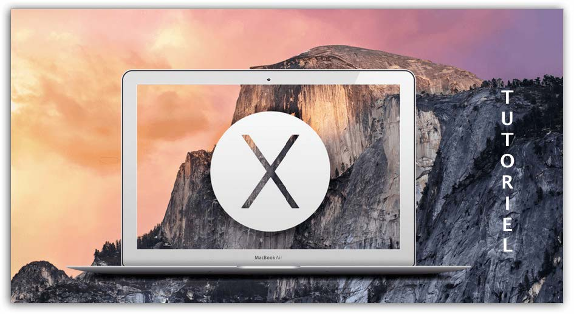
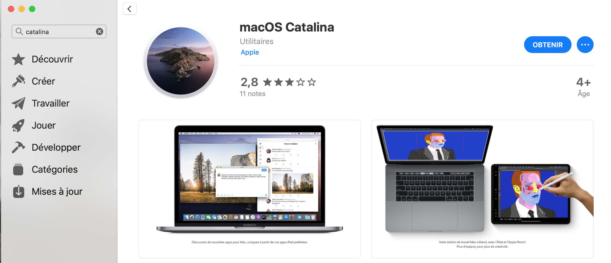
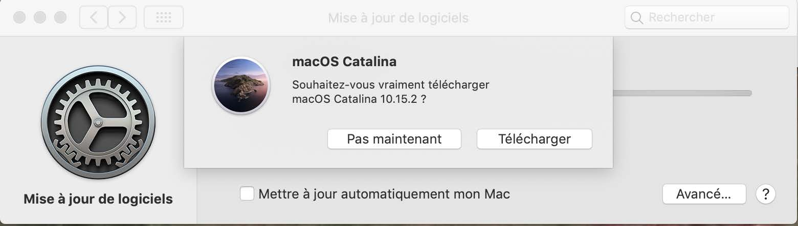
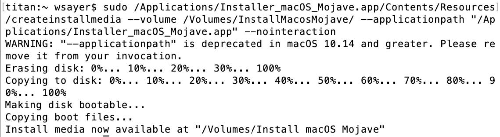
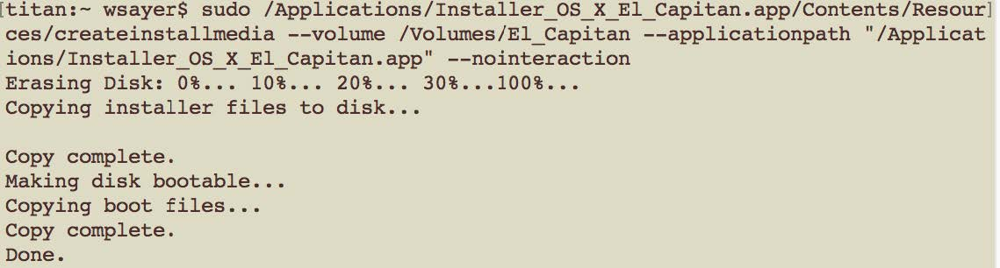

# Installation de macOS via Clé USB

## Abstract
**MOJAVE** est la toute dernière version de **macOS** supportant les applications
**32 bits**. En effet, avec la sortie fin 2019 de la version **Catalina**, celle-ci ne supporte plus les applications **32 bits**. Avant d’effectuer la mise à niveau vers la version **Catalina**, 
veuillez vérifier que vous n’utilisez plus d’applications uniquement **32 bits**. 
Ce tutoriel présente la manière de réinstaller une station de travail **APPLE from scratch** à partir d’une clé USB contenant la distribution d'un **macOS**.

`Remarque :` À partir de la version *Snow Leopard* (**OS X 10.6.8**) et versions ultérieures, vous pouvez installer les systèmes d’exploitation **Yosémite** (version **10.10**) et **El Capitan** (version **10.11**). Si votre système d’exploitation est antérieur à la version **10.6.8**, alors vous devrez acheter à partir du site d’**Apple** la version **Snow Leopard** (**10.6.8**) qui permet ensuite de migrer vers la version **Yosémite** ou **El Capitan**, en fonction de votre matériel, car chez **APPLE**, l’obsolescence programmée n’est pas une utopie.



## Créer une clé USB bootable pour installer macOS CATALINA

### Prérequis :
- Une clé USB 8 Go minimum.
- Le système d’exploitation macOS MOJAVE.
- L’utilitaire disque Natif de macOS MOJAVE.

### Récupération du programme d’installation macOS CATALINA :
Pour réaliser la création de notre clé USB d’installation, il faut tout d’abord, sur l’**apps store** d’**APPLE**, télécharger l’image du fichier d’installation. Ceci n'est possible uniquement si votre ordinateur possède la version précédente à **Catalina** soit le macOS **MOJAVE**, version **10.14**. Dans le cas contraire, il existe des sites internet qui permettent de retoruver ces distributions, en voici quelqu'uns :

- [journaldulapin](https://www.journaldulapin.com/2019/11/13/mac-os-app-store/)
- [support apple](https://support.apple.com/fr-fr/HT211683)
- [macworld uk](https://www.macworld.co.uk/how-to/download-old-os-x-3629363/)

`Information :` Pour bénéficier des dernières fonctionnalités, tout en préservant la sécurité, la stabilité, la compatibilité et les performances de votre Mac, il est important de mettre régulièrement à jour votre système. Apple recommande de toujours utiliser la dernière version de **macOS** compatible avec votre Mac.

Cette opération doit se faire lors de la sortie de la mise à jour. Si vous le faites quelques mois plus tard, comme par exemple au moment de la sortie d’une nouvelle version d’un **MacOS**, vous risquez de ne plus trouver la version souhaitée dans l’**appstore**. Je pense que c’est une volonté d’**APPLE** pour promouvoir les nouvelles versions et avoir les dernières mises à jour au niveau de la sécurité de votre système
d’exploitation. Cependant, toutes les machines ne pourront pas accueillir un système comme **MOJAVE** ou **CATALINA**. C’est la raison pour laquelle, il faut précieusement garder toutes les versions des distributions de **MacOS** sur un volume **NTFS** ou **ReFS** au sein de vos serveurs de fichiers.

- Lancer l’application **App Store**. Il est nécessaire d’avoir un compte **id Apple** pour pouvoir faire ce genre de manipulation.
- Cliquez sur le bouton Obtenir.
- Une fenêtre s’affiche, cliquez sur le bouton `Télécharger`.
- Laissez se dérouler le téléchargement, visible dans la rubrique `Achats`. Il y a environ 5,2 Go à télécharger.
- Copiez cette application stockée dans le `dossier Applications`, sur un support externe. Dans mon cas, je l’ai copiée sur le volume **iSCSI ISO$** du serveur `WDSMDT`.
- Laissez l’original à sa place dans le `dossier Applications`.

Voici des images réalisées à partir d’un **macOS MOJAVE** pour télécharger la dernière version du système d’exploitation d'**APPLE** :





Lorsque le paquet du programme d’installation brut de **macOS CATALINA** est téléchargé :
- La fenêtre d’installation se lance automatiquement.
- Ne cliquez pas sur le bouton `Continuer`.
- Depuis la barre des menus, allez dans `Installation de macOS` / `Quitter Installation de macOS`.
- Localisez dans votre `dossier Applications` le paquet brut d’installation nommé : `Installer OS X CATALINA`.

`Attention :` Après le téléchargement et le lancement automatique de l’image, vous devez arrêter l’installation sur le premier écran et ne pas allez plus loin.

### Préparation de la clé USB d’installation :
- Insérez votre clé USB vierge dans un port USB (pas sur le clavier mais uniquement sur le mac).
- Lancer l’utilitaire de disque qui se trouve dans `Application / Utilitaires`.
- Dans la colonne latérale de gauche, sélectionnez votre clé USB. Pas sa partition déjà existante mais la clé physique. Elle porte le nom du fabricant et indique sa capacité.
- Dans la partie droite de la fenêtre, cliquez sur l’onglet `Partition` ou `Partitionner` si aucune partition n’existe.
  * Dans le cas où il existe une partition, cliquez sur `Effacer`. Renseignez le label de la partition, le système de fichier et appuyez sur le bouton `OK`.
- Sous la zone `Schéma partition`, une sélection déroulante affiche `Actuel`.
- Déroulez cette liste, et choisissez `Partition 1`.
- Cliquez sur le bouton `Options` se trouvant au bas de cette zone.
- Sélectionnez le `GUID` tout en haut des 3 choix possibles et validez sur le bouton `OK`.
- Vérifiez que le format de fichier choisi est bien `macOS étendu (journalisé)`.
- Donner le nom **catalina** à cette clé.
- Cliquez sur le bouton `Appliquer` en bas à droite. (ou bouton `OK`.
- Validez la demande de confirmation.
- Laissez l’opération s’exécuter.

A ce stade, la clé USB est prête pour l’opération suivante.

### Création de la clé d’installation :
Exécutez l’application `Terminal` qui se trouve dans `Application/Utilitaires`.
- Faîtes un copier/coller de la ligne suivante dans le terminal :

`Attention`, les options pour l’installation de la distribution (volume, applicationpath, nointeraction) prennent deux tirets.
`Attention`, ne pas oublier le caractère `/` à la fin du nom de la clé USB : `/Volumes/MacOSHighSierra/`

`Pour la distribution Mojave :`
```
sudo /Applications/InstallMacosMojave/Contents/Resources/createinstallmedia –-volume /Volumes/InstallMacosMojave/ --applicationpath “/Applications/InstallMacosMojave.app” –-nointeraction
```

`Pour la distribution High Sierra :`
```
sudo /Applications/Installer_macOS_High_Sierra.app/Contents/Resources/createinstallmedia –-volume /Volumes/MacOSHighSierra/ –-applicationpath “/Applications/Installer_macOS_High_Sierra.app” –-nointeraction
```

`Pour la distibution Sierra :`
```
sudo /Applications/Install_macOS_Sierra.app/Contents/Resources/createinstallmedia –-volume /Volumes/OSSIERRA/ –-applicationpath “/Applications/Install_macOS_Sierra.app” –-nointeraction
```

`Pour la distibution El Capitan :`
```
sudo /Applications/Installer_OS_X_El_Capitan.app/Contents/Resources/createinstallmedia –-volume /Volumes/El_Capitan/ –-applicationpath “/Applications/Installer_OS_X_El_Capitan.app” –-nointeraction
```

`Pour la distibution Yosemite :`
```
sudo /Applications/Install OS X Yosemite.app/Contents/Resources/createinstallmedia –-volume /Volumes/yosem/ –-applicationpath “/Applications/Install OS X Yosemite.app” –-nointeraction
```

- Validez par la touche `Entrée`.
- À la demande, donnez votre mot de passe administrateur.
- Laissez le processus se dérouler. L’opération peut durer plus ou au moins une demie-heure.





### Installation de Catalina avec la clé USB :
- Eteignez l’ordinateur à réinstaller.
- Insérez votre clé USB dans un port USB de votre ordinateur.
- Appuyez sur le bouton `Marche/Arrêt` de votre mac et appuyez immédiatement sur la touche `ALT` de votre clavier en la maintenant.
- À l’affichage de deux icônes représentant votre disque dur et la clé USB d’installation, vous pouvez relâcher votre doigt de la touche `ALT`.
- Sélectionnez et double-cliquez sur l’icône de la clé USB pour lancer l’installation.
- Le programme d’installation se charge en mémoire vive.
- Vous êtes dans l’interface graphique du programme d’installation de Catalina.
- Lancer l’utilitaire disque qui se trouve dans `Application/Utilitaires` pour formater le disque dur de la machine.

`Attention :` si vous ne formater pas le disque mais que vous exécutez le programme d’installation directement, cette installation sera considérée
comme une mise à jour. Toutes les applications et données seront conservées.

- Après avoir formaté le disque dur de la machine, vous pouvez cliquer sur l’icône du programme d’installation pour lancer l’installation de **macOS Catalina**.

### Remarques :
Lorsque votre **macOS**  est en panne au niveau du système d’exploitation ou si vous avez un secteur défectueux, vous pouvez démarrer le mode dépannage.
Voici la combinaison de touche à exécuter au démarrage de l’ordinateur : `MAJ + cmd + R`
